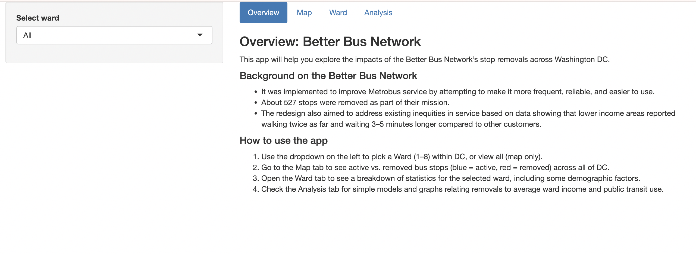
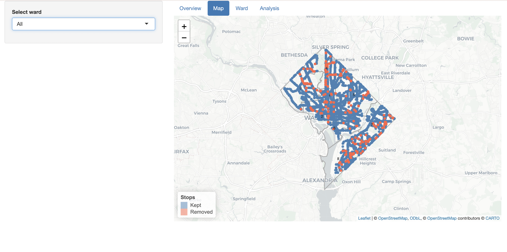
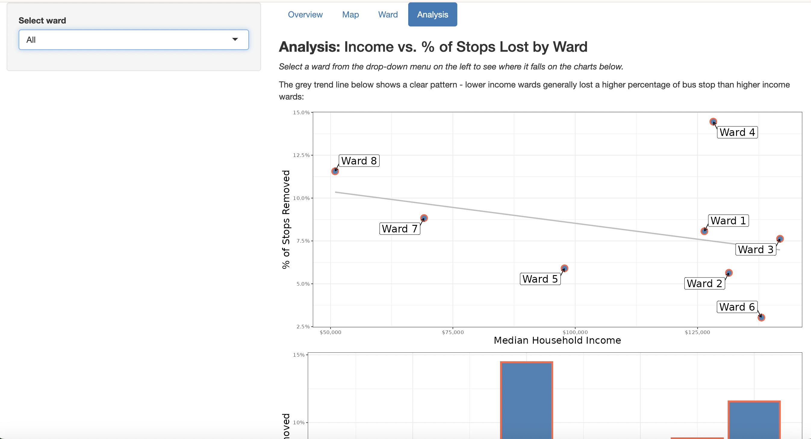
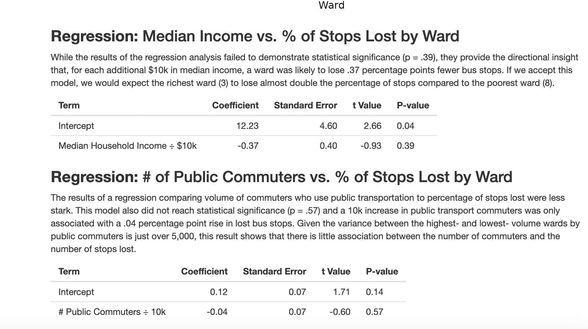

WMATA Better Bus Network Analysis

## Overview

This project is an interactive R Shiny application that explores the impact of bus stop removals under the Washington Metropolitan Area Transit Authority (WMATA) Better Bus Network redesign. The application allows users to investigate where bus stops were removed across Washington, DC and examine how these changes relate to demographic and socioeconomic characteristics at the ward level.

The goal of the project is to provide an accessible tool for exploring transportation policy decisions and their potential implications for equity, accessibility, and public transit service distribution.

Live Application: https://jrb0.shinyapps.io/WMATA_better_bus_app/

## Application Preview

Homepage

Interactive Bus Stop Map

Ward Level Analysis

Statistical Analysis

## Final Analysis

The analysis explored whether bus stop removals under WMATA's Better Bus Network redesign were associated with demographic and socioeconomic characteristics across Washington, DC wards.

Two linear regression models were examined:

- **Median Household Income vs. Percentage of Bus Stops Removed**
- **Number of Public Transit Commuters vs. Percentage of Bus Stops Removed**

While neither model reached statistical significance, the results provided useful directional insights. The income model suggested that higher-income wards tended to experience slightly lower percentages of bus stop removals, while the commuter model indicated little relationship between transit usage and stop removals.

Overall, the findings did not provide strong statistical evidence that bus stop removals were systematically associated with income levels or public transit commuter volume. However, the project demonstrates how geographic, demographic, and transportation data can be combined to evaluate public policy decisions and explore questions of accessibility and transportation equity.

## Project Objectives

* Visualize active and removed WMATA bus stops across Washington, DC.
* Explore differences in stop removals across city wards.
* Examine relationships between transit service changes and demographic characteristics.
* Provide an interactive platform for transportation policy and equity analysis.
* Demonstrate the use of spatial data visualization, statistical analysis, and interactive dashboard development.

## Features

1. Interactive Bus Stop Map
* Displays active and removed WMATA bus stops.
* Allows users to explore transit changes geographically.
* Supports ward-level investigation of stop removals.

2. Ward Level Demographic Analysis
* Select any Washington, DC ward using a dropdown menu.
* View demographic and socioeconomic information associated with the selected ward.
* Compare transit changes across different areas of the city.
 
3. Statistical Visualizations
* Explore patterns in bus stop removals.
* Analyze relationships between transit service changes and ward characteristics.
* View graphical summaries that support policy discussion and decision-making.

4. Transportation Equity Focus
* Investigates how infrastructure changes may affect different communities.
* Highlights the intersection of public transportation, demographics, and accessibility.

## Data Sources

The application combines:

* WMATA Better Bus Network data
* Geographic and ward boundary data
* Demographic and socioeconomic data for Washington, DC wards

These datasets are integrated to provide both spatial and statistical perspectives on transit service changes.

## Technologies Used

* R
* Shiny
* ggplot2
* dplyr
* leaflet
* sf
* tidyr
* R Markdown

## Skills Demonstrated

* Data Cleaning and Preparation
* Exploratory Data Analysis (EDA)
* Geographic Information Systems (GIS) Visualization
* Statistical Modeling
* Interactive Dashboard Development
* Data Storytelling
* Public Policy and Equity Analysis
* R Programming

## Key Takeaways

This project demonstrates how data science tools can be used to analyze public transportation policy and communicate complex findings through interactive visualizations. 
By combining geographic, demographic, and statistical analysis, the application helps users better understand how transit system redesigns may impact different communities throughout Washington, DC.

This project was completed as a team project for a Data Science course at American University.

Authors:
Arielle Cameron, Collin Brown, Jonathan Bacharach, Maulie Clermont

